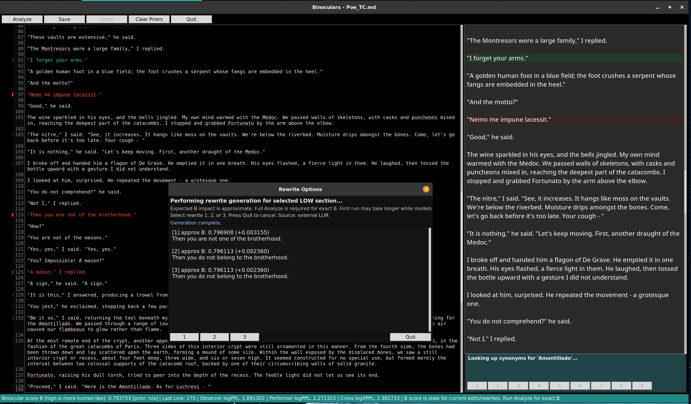
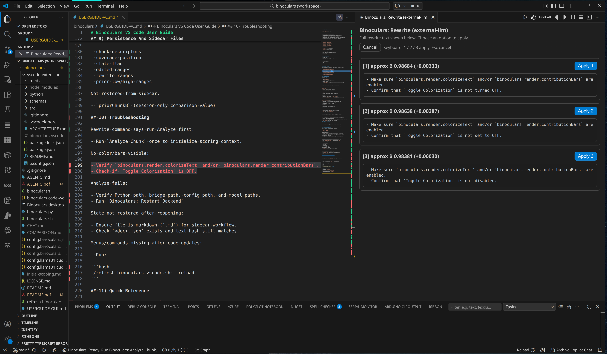

# Binoculars

`Binoculars` is a local workflow tool for AI text forensics and humanization. It uses two related `llama.cpp` models - observer and performer - to compute Binoculars-style scores from full logits, then guides you through iterative rewrites of high-risk text spans in the GUI.

If you need to evaluate or revise long-form text without sending documents to a remote detector, this repository provides a practical solution.

- Data and models remain local by default.
- The system computes inspectable signals (`logPPL`, `logXPPL`, `B`) rather than opaque labels.
- Paragraph-level heatmaps show exactly where score pressure originates.
- For any flagged line or selected block, you can generate three rewrite options and rank them by estimated B impact for quick humanization passes.
- Full analysis can be re-run only when you need exact checkpoint scores.
- Optionally, you may use an OpenAI-compatible rewrite backend, with automatic fallback to internal local generation if needed.

Reference paper (also in `background/`): https://arxiv.org/abs/2401.12070

Acknowledgment: The Binoculars paper authors - Abhimanyu Hans, Avi Schwarzschild, Valeriia Cherepanova, Hamid Kazemi, Aniruddha Saha, Micah Goldblum, Jonas Geiping, and Tom Goldstein - provided the foundational method for this project.

<p align="center">  <br/> <em>Screenshot of the tkinter GUI</em> </p>
<p align="center">  <br/> <em>Screenshot of the VS Code extension</em> </p>

## VS Code Extension

This repository also includes a native VS Code extension in `vscode-extension/` that provides the Binoculars workflow directly inside the editor.

Current extension capabilities:

- Analyze current chunk and analyze next chunk.
- Analyze all remaining chunks in sequence (`Analyze All`) with confirmation.
- Rewrite current selection/line with ranked options.
- LOW/HIGH text overlays plus per-line contribution gutter bars.
- One-click `Clear Priors` plus prior contributor faint backgrounds (major contributors only) after re-analysis.
- `Toggle Colorization` to hide/show text overlays without losing analysis state.
- Chunk-aware status bar metrics, including `Prior B` when available.
- Debounced live `Est. B` forecast in status while manually editing analyzed text.
- Sidecar persistence in `*.json` next to markdown files for restoring analysis state.

Detailed extension guide:

- `USERGUIDE-VC.md`

## What This Does

Given input text, `binoculars` computes:

- Observer log-perplexity: `logPPL`
- Cross log-perplexity: `logXPPL` (observer distribution scored against performer distribution)
- Binoculars ratio: `B = logPPL / logXPPL`

It can also generate paragraph-level diagnostics and heatmaps.

## Why Local / Full Logits

The Binoculars-style cross-entropy term depends on full next-token distributions. In practice, this means:

- `logits_all=True` is required
- Top-k API logprobs are not sufficient for faithful reconstruction
- Observer and performer tokenizer alignment must be exact

The reference paper is included at:

- `background/2401.12070v3.pdf`

Additional local design notes:

- `initial-scoping.md` (local, gitignored)

## Theory

Let a tokenized document be:

$$ x_1,\, x_2,\, \dots,\, x_T $$

with observer model $M_o$ and performer model $M_p$.

**Observer log-perplexity:**

$$ \log \mathrm{PPL}_{M_o}(x) = -\frac{1}{T-1} \sum_{t=1}^{T-1} \log p_{M_o}(x_{t+1} \mid x_{\leq t}) $$

**Cross log-perplexity:**

$$ \log \mathrm{XPPL}_{M_o, M_p}(x) = -\frac{1}{T-1} \sum_{t=1}^{T-1} \sum_{v \in V} p_{M_o}(v \mid x_{\leq t}) \log p_{M_p}(v \mid x_{\leq t}) $$

**Binoculars score:**

$$ B(x) = \frac{\log \mathrm{PPL}_{M_o}(x)}{\log \mathrm{XPPL}_{M_o, M_p}(x)} $$

The current UI/CLI interpretation used by this repository:

- Higher `B` is treated as more human-like
- Lower paragraph `logPPL` is treated as more AI-like for heatmap colouring

Important: This is a scoring signal, not proof of authorship.

## Repository Layout

- `binoculars.py`: main CLI and GUI application; `binoculars.sh`: wrapper that activates venv, cleans old instances, and forwards Ctrl-C
- `binocular.sh`: alias wrapper (`exec binoculars.sh`); `config.binoculars.json`: master profile selector (`default` and `profiles`)
- `config.binoculars.llm.json`: optional OpenAI-compatible rewrite backend config for GUI rewrite suggestions; `config.llama31.cuda12gb.fast.json`: fast profile (currently `text.max_tokens=4096`)
- `config.llama31.cuda12gb.long.json`: long profile (currently `text.max_tokens=12288`); `USERGUIDE-GUI.md`: detailed GUI user guide and iterative workflow guidance
- `vscode-extension/`: VS Code extension source, manifest, bridge, and packaging assets
- `USERGUIDE-VC.md`: detailed VS Code extension user guide
- `background/2401.12070v3.pdf`: background paper; `samples/`: sample markdown inputs
- `tests/test_regression_v1_1_x.py`: regression suite; `tests/fixtures/`: fixture docs used by regression tests

## Requirements

- Linux or macOS shell
- Python 3.10 or newer
- `numpy`
- `llama-cpp-python`
- Optional: `nltk` (for local WordNet synonym expansion in GUI)
- GGUF models on local disk

Install into the repository venv:

```bash
venv/bin/pip install numpy llama-cpp-python
```

Optional WordNet setup for richer synonym suggestions:

```bash
venv/bin/pip install nltk
venv/bin/python - <<'PY'
import nltk
nltk.download("wordnet", quiet=True)
nltk.download("omw-1.4", quiet=True)
PY
```

## Model Files

Configs in this repository point to local model paths under `models/`, for example:

- Base observer: Llama 3.1 8B Q5_K_M
- Instruct performer: Llama 3.1 8B Instruct Q5_K_M

You may use different models if tokenizer and vocabulary alignment are preserved.

## Configuration

### 1) Master Profile Config

`config.binoculars.json` selects profile by label:

```json
{
  "default": "long",
  "profiles": {
    "fast": "/abs/path/config.llama31.cuda12gb.fast.json",
    "long": "/abs/path/config.llama31.cuda12gb.long.json"
  }
}
```

`profiles` entries can be either:

- String path (current repository default), or
- Object form:

```json
{
  "path": "/abs/path/config.json",
  "max_tokens": 8192
}
```

`max_tokens` in object form (if present) overrides `text.max_tokens` in the concrete profile.

### 2) Concrete Observer/Performer Profile

Each profile must define:

- `observer`
- `performer`

Optional blocks:

- `text` (`add_bos`, `special_tokens`, `max_tokens`)
- `cache` (`dir`, `dtype`, `keep`)

Notes:

- `n_ctx: 0` means auto (`n_ctx = analyzed token count`)
- `text.max_tokens > 0` truncates input token window
- `cache.dtype` may be `float16` or `float32`

### 3) Optional Rewrite LLM Config (GUI)

If `config.binoculars.llm.json` is present and enabled, GUI rewrite suggestions can use an external OpenAI-compatible endpoint. If missing or disabled, internal performer-model generation is used. If present but unreachable or invalid at runtime, GUI rewrites automatically fall back to internal generation.

Supported fields include:

- `llm.enabled`; `llm.endpoint_url`
- `llm.request_path` (default `/chat/completions`); `llm.model`
- `llm.api_key` or `llm.api_key_env` (also supports `OPENAI_API_KEY` when enabled); `llm.api_key_header` / `llm.api_key_prefix`
- `llm.timeout_s`; `llm.max_tokens`
- `llm.temperature`; `llm.top_p`
- `llm.context_chars_each_side`; `llm.context_paragraphs_each_side`
- `llm.context_window_max_chars`; `llm.extra_headers`
- `llm.extra_body`

Example:

```json
{
  "llm": {
    "enabled": true,
    "endpoint_url": "http://localhost:4141/v1",
    "model": "gpt-4.1",
    "request_path": "/chat/completions",
    "api_key_env": "OPENAI_API_KEY",
    "max_tokens": 220,
    "temperature": 0.78,
    "top_p": 0.95,
    "context_chars_each_side": 1800,
    "context_paragraphs_each_side": 2,
    "context_window_max_chars": 5200
  }
}
```

## Execution Model

`binoculars.py` loads models sequentially:

1. Tokenize with observer and performer in `vocab_only=True`
2. Hard-fail if tokenization differs
3. Run observer with full logits
4. Persist observer logits to memmap
5. Unload observer, load performer
6. Compute cross-entropy term from observer distribution versus performer logits
7. Emit metrics and optional diagnostics or heatmap

This approach keeps VRAM usage lower than concurrent dual-model loading.

## CLI Usage

Show help:

```bash
./binoculars.sh --help
```

Basic usage:

```bash
./binoculars.sh samples/Athens.md
```

JSON output:

```bash
./binoculars.sh --config long samples/Athens.md --json
```

Heatmap mode:

```bash
./binoculars.sh --config fast --input samples/Athens.md --heatmap --diagnose-top-k 10
```

Diagnostics:

```bash
./binoculars.sh --diagnose-paragraphs --diagnose-top-k 10 samples/Athens.md
./binoculars.sh --diagnose-paragraphs --diagnose-print-text samples/Athens.md
```

Run from any directory:

```bash
cd ~
/home/npepin/Projects/binoculars/binoculars.sh --config long /tmp/doc.md --json
```

Alias wrapper:

```bash
/home/npepin/Projects/binoculars/binocular.sh --config fast /tmp/doc.md
```

### Input Rules

- Provide input as either:
  - Positional `INPUT`, or
  - `--input INPUT`
- If both are provided, the command errors
- If multiple positional paths are given, only the first is used (a warning is emitted)
- If no input is given, stdin (`-`) is used

### CLI Options

- `--master-config FILE`: master profile mapping file; `--config PROFILE`: profile label (`fast`, `long`, etc.)
- `--input FILE|-`: explicit input; `--output FILE`: write text output
- `--json`: emit JSON result object; `--diagnose-paragraphs`: rank low-perplexity hotspot paragraphs
- `--diagnose-top-k N`: hotspot count (also used by heatmap selection); `--diagnose-print-text`: print full hotspot text segments
- `--heatmap`: emit console and markdown heatmap output; `--gui FILE`: launch interactive GUI editor/analyzer

`--heatmap` cannot be combined with `--json`.

`--gui` is mutually exclusive with:

- `--input`
- Positional `INPUT`
- `--output`
- `--json`
- `--heatmap`

## Heatmap Mode (`--Heatmap`)

When enabled:

- Console output shows:
  - Red and green highlights (ANSI)
  - Simple note markers like `[1]`
  - Line-drawing notes table
  - Wrapped layout (about 85% terminal width)
- File output writes markdown to:
  - `[[HTML_BLOCK_6]]_heatmap.md` in the same directory as the source input
  - Existing heatmap file is backed up first:
    - `[[HTML_BLOCK_7]].YYYYMMDD_HHMMSS.bak` (timestamp format may vary by implementation helper)

Heatmap semantics:

- Red sections: lowest paragraph `logPPL`
- Green sections: highest paragraph `logPPL`
- Note table columns:
  - `Index`; `Label`
  - `% contribution`; `Paragraph`
  - `logPPL`; `delta_vs_doc`
  - `delta_if_removed`; `Transitions`
  - `Chars`; `Tokens`

## GUI Mode (`--Gui [[HTML_BLOCK_8]]`)

Launches an editor/analyzer with:

- Window/app name: `Binoculars`
- Left pane: editable source text
- Left gutter:
  - Logical line numbers
  - Red and green contribution bars per line
- Right pane: live markdown preview
- Right-pane footer: real-time synonym panel for clicked words
- Controls:
  - `Open`
  - `Analyze`
  - `Analyze Next` (shown after first chunk when unscored text remains)
  - `Save`
  - `Undo` (one level)
  - `Clear Priors`
  - `Quit`
- Status bar:
  - `Binocular score B (high is more human-like): ...`
  - Shows active chunk range and chunk-relative metrics

For a detailed workflow-oriented guide, see:

- `USERGUIDE-GUI.md`

### GUI Behaviour

- `Analyze`:
  - On first run, analyzes from document start (`char 0`) up to the token-limited chunk boundary
  - On later runs, analyzes from the active chunk start (not from the cursor line itself)
  - Replaces any overlapping prior chunk descriptor with the new analysis result
  - Can move the effective chunk end boundary forward or backward after edits
  - Preserves cursor and top-view position
  - Updates red and green foreground highlights
  - Updates hover tooltips (`% contribution`, `logPPL`, `delta_if_removed`, `delta_vs_doc`, ranges)
  - Updates status metrics for the active chunk
  - Keeps `Performing analysis on current text...` visible until analysis finishes
  - Edits since last analysis show in yellow

- `Analyze Next`:
  - Appears after first successful analysis if unscored text remains
  - Starts at the contiguous covered tail (`analysis_covered_until`)
  - Extends coverage into the next token-limited chunk
  - Remains available until contiguous coverage reaches end-of-document

- Active chunk selection priority for status and `Analyze`:
  - Selection overlap with analyzed chunks (largest overlap wins)
  - Else cursor line if visible and inside an analyzed chunk
  - Else majority overlap with currently visible editor window
  - Else nearest analyzed chunk by distance

- Chunk boundaries are operational, not immutable:
  - Chunks are stored as descriptors with local metrics.
  - Coverage intervals are merged for rendering/unscored display.
  - Overlapping chunk descriptors are replaced on re-analysis.
  - Result: boundaries can shift after edits and a second `Analyze`.

- Example:
  - First pass analyzes lines `1-999` as chunk 1.
  - Cursor is at line `999` and user presses `Analyze`.
  - Binoculars re-analyzes starting at chunk-1 start (line 1), not line 999.
  - If edits changed token density, chunk 1 may now end at line `972` or `1031`.
  - Status then reports metrics for that updated chunk range.

- On advancing to the next `Analyze`, previous highlights or edits are reduced to faint backgrounds, indicating prior states.
- Executing `Clear Priors` clears only these faint backgrounds, leaving other markings intact.
- The `Save` command initiates a write operation:
- `[[HTML_BLOCK_9]]_edited_YYYYMMDDHHMM.md`
- Output is directed to the same directory as the source file.
- During the write process, a modal `Saving...` popup displays the destination filename.

Always-on English spell checking is active:
- Misspelled words are underlined in red.

Synonym suggestions are available:
- Left-click any word in the left pane to request synonyms.
- Lookup actions are debounced to prevent triggering during drag-selection.
- The synonym panel displays up to nine options in three columns, each with a `1..9` button.
- Selecting a synonym replaces the chosen word and marks the change as an edit (yellow).
- The lookup sequence is: local fallback list, then WordNet (if installed), then Datamuse API as a fallback.

Rewrite suggestions can be accessed as follows:
- Right-click a red (`LOW`) paragraph segment to open three rewrite options. Alternatively, highlight a block (multi-line selection allowed) and right-click to request block rewrites.
- Highlighted-block rewrites round the selection to full lines. If unscored lines are included, they are preserved unchanged while scored/analyzed lines are rewritten.
- The popup displays the approximate B impact for each option (exact B requires `Analyze`). Options are sorted by expected B increase, with more human-like choices first.
- Select an option using the mouse or keyboard (`1`/`2`/`3`), or `Quit`. The selected rewrite is inserted as an edit (yellow), and prior backgrounds are preserved according to previous line status.
- The B score is not automatically recalculated; the status marks it as stale until the next `Analyze`.

### How Estimate Values Are Calculated

Two different estimate paths exist in the VS Code workflow:

Model usage note:
- Both estimate paths use real local model inference (not static heuristics).

1. Rewrite option estimates (in rewrite popup):
- For each candidate rewrite, Binoculars builds a local scoring window around the rewritten span.
- It computes observer `logPPL` locally for:
  - the original local window,
  - and each rewritten local window.
- It converts local observer change into a document-level observer delta by transition-count normalization.
- It then approximates:
  - `approx_observer_logPPL = base_doc_observer_logPPL + delta_doc_observer`
  - `approx_B = approx_observer_logPPL / base_doc_cross_logXPPL`
- `delta_B = approx_B - base_doc_B`.
- Candidates are ranked descending by `delta_B` (then `approx_B`), so options expected to increase B most are listed first.

Important limitation:
- The cross term (`logXPPL`) is held fixed to the current baseline during rewrite estimation.
- Therefore popup values are fast approximations for ranking, not exact post-rewrite scores.

2. Live edit forecast while typing (`Est. B` in status):
- When text changes in an analyzed document, the chunk is marked stale and a debounced forecast job is scheduled (about 900ms).
- The estimator identifies the active analyzed chunk at the cursor.
- It computes observer-only logPPL from the active chunk start on the edited text.
- It converts that to `Est. B` by dividing by the current chunk baseline `cross_logXPPL` (held fixed until full Analyze).
- Returned estimate is shown as:
  - `Est. B ... (approx)`.
- To improve responsiveness, the daemon keeps an observer model instance warm for a short idle window and auto-unloads it after inactivity.

Important limitation:
- This live estimate is also an approximation in workflow terms: it is a forecast over the active chunk context during editing and does not replace a full explicit `Analyze` checkpoint.
- `Analyze` / `Analyze Next` / `Analyze All` remain the source of truth for persisted exact chunk metrics and coverage state.

Delete and undo operations are tracked:
- Deleting a selected block with `Delete` or `Backspace` is recorded as a single undoable action.
- `Undo` supports one level of undo for selected-block delete, synonym replacement, red-segment rewrite, and block rewrite.
- Successful undo status is shown briefly, after which metrics return.

Preview selection mirroring is supported:
- Selecting a block in the left pane causes the right preview to mirror the same line range.
- Selected preview lines display LOW, HIGH, or neutral background styles.

Status-bar transient messages:
- Non-analysis events (such as Save, Clear Priors, Delete, or Undo) temporarily replace metrics.
- Most transient messages restore metrics after approximately eight seconds.
- A successful `Undo applied...` restores metrics quickly, in about 1.8 seconds.

### Preview Sync and Debug Controls

Environment variables:
- `BINOCULARS_GUI_DEBUG=1`: Starts with the debug overlay enabled; can be toggled in-app with `F9`.
- `BINOCULARS_PREVIEW_VIEW_OFFSET_LINES=-3`: Adjusts vertical view calibration for the right pane, affecting only the preview viewport position (not line mapping).

## Wrapper Behaviour (`Binoculars.Sh`)

`binoculars.sh` performs the following:
- Activates the repository virtual environment.
- Runs `binoculars.py`.
- Deactivates the virtual environment on exit.
- Forwards Ctrl-C to the child process.
- Terminates prior running instances by default to free GPU or VRAM resources.

To disable automatic termination if necessary:

```bash
BINOCULARS_DISABLE_AUTO_KILL=1 ./binoculars.sh ...
```

## Output Contract (JSON)

Top-level keys include:
- `input`
- `observer`
- `performer`
- `cross`
- `binoculars`
- `cache`

Optional:
- `diagnostics.low_perplexity_spans` (when `--diagnose-paragraphs` is enabled)

## Performance and Tuning Notes

- Main memory usage is driven by full logits (`tokens x vocab`).
- Long contexts are resource-intensive, even if VRAM appears available.
- `text.max_tokens` is the primary limit for runtime and memory safety.
- `n_ctx: 0` is typically optimal (auto-sizes to analyzed tokens).
- Observer and performer components are loaded sequentially.

Current shipped profile token limits:
- `fast`: 4096
- `long`: 12288

Adjust these values in profile JSON files as needed for your hardware.

## Troubleshooting

Tokenizer mismatch error:
- Use a model pair from the same family (base and instruct sibling).
- Ensure both configurations reference compatible tokenizer and vocabulary models.

Missing file errors:
- Verify `config.binoculars.json` profile paths.
- Check model paths in the configuration JSON files.

GUI unavailable:
- Confirm that Tkinter is installed in your Python environment.

Unexpected GPU memory contention:
- Close other LLM processes, or rely on the wrapper's auto-kill feature.
- Reduce `text.max_tokens`.
- Lower `n_batch` if necessary.

llama.cpp context warnings:
- Low-signal llama.cpp runtime logs (`INFO`, `WARN`, `DEBUG`, including `llama_context` initialization messages) are suppressed by default for cleaner output.
- To disable log suppression for debugging, set `BINOCULARS_SUPPRESS_LLAMA_CONTEXT_WARNINGS=0`.

## Tests

To run the regression suite:

```bash
./venv/bin/python -m unittest -v tests/test_regression_v1_1_x.py
```

## License

PolyForm Noncommercial License 1.0.0. This project is licensed under the **PolyForm Noncommercial License 1.0.0** (see `LICENSE.md`).

Important scope clarification:
- The licence applies to the code, configuration, scripts, and documentation in this repository.
- It does not claim ownership of, or restrict use of, the Binoculars approach described in the associated paper.

Key points:
- Noncommercial use only: use, modification, and redistribution are permitted for noncommercial purposes.

- Commercial use requires explicit authorization. Any paid product or service that incorporates this code must have the author's permission.

- Attribution is mandatory. Redistribution or use of substantial portions of this project must include clear credit and preserve the licence and notice requirements described in `LICENSE.md`.

For commercial applications, contact the author to discuss participation or licensing.

## Limitations

- No calibrated classifier thresholds are implemented yet.
- There is no claim of definitive authorship attribution.
- Markdown is processed as plain text; semantic markdown parsing is not performed.
- Long documents may need to be truncated due to full-logit computational cost.

## Chunk-Aware Large-File Analysis (Current Behaviour)

For files that exceed one-pass token limits, GUI analysis is chunk-aware.

- First `Analyze` starts at document start and scores the first token-limited chunk.
- `Analyze Next` progresses from contiguous covered tail into the next chunk.
- `Analyze` on later runs targets the active chunk start, not the cursor line.
- Active chunk metrics drive the status bar and rewrite-approximation baselines.
- Unscored regions are rendered as complement intervals over full document length.
- Chunk boundaries may shift after edits because overlapping chunk descriptors are replaced by the newest analysis.

### Chunking FAQ

Q: If my cursor is near the end of chunk 1 (for example line 999) and I press `Analyze`, what gets analyzed?

A: Binoculars analyzes from the active chunk start, not from the cursor line. In that case it re-analyzes from the start of chunk 1 (often line 1) forward to the current token-limited boundary.

Q: Will chunk boundaries stay fixed forever once discovered?

A: No. Chunk metrics are always chunk-local, but chunk boundaries are operational. If text edits change token density, a later re-analysis can move the chunk end earlier or later, and overlapping prior chunk descriptors are replaced by the new result.

## Safety / Responsible Use

Treat outputs as probabilistic signals within a broader review process. Do not use this tool as the sole basis for punitive or high-stakes actions.

## Appendix: GPTZero vs Binoculars (Public Information)

This appendix summarizes public details about GPTZero and compares them to the Binoculars method implemented here.

### 1) What Is Known About Gptzero

Public GPTZero materials describe a layered detection system.

- The initial release (January 2023) focused on `perplexity` and `burstiness` as core indicators.
- Current documentation describes a probabilistic, sentence-level and document-level deep-learning detector that does not rely solely on perplexity or burstiness.
- GPTZero states its production system combines multiple components and outputs trinary sentence labels (`human`, `mixed`, `AI`) with confidence and uncertainty handling.

Details not publicly disclosed:

- Exact model architectures.
- Training data composition.
- Post-processing and thresholding methods.
- Adversarial hardening techniques.

Therefore, GPTZero is partially documented, but the full internal mechanisms remain proprietary.

### 2) How Binoculars Differs

Binoculars is more explicit in its mechanism.

- It is defined by transparent equations over two related language models:
  - observer `logPPL`
  - observer-vs-performer `logXPPL`
  - ratio `B = logPPL / logXPPL`
- It uses a zero-shot detection approach, requiring no target-model-specific training for the detector.
- The paper reports strong low-FPR performance, detecting over 90% of generated samples at 0.01% FPR in tested scenarios.
- Head-to-head comparisons in the paper show Binoculars outperforming GPTZero in their 2023 evaluation setup.

### 3) Why Binoculars Can Compete with Gptzero

Available evidence indicates Binoculars can operate in the same competitive tier, with some caveats.

- Published results show strong discrimination at very low false-positive rates, a key deployment factor.
- The mechanism is model-agnostic in the zero-shot sense and can generalize to unseen generators when assumptions hold.
- The approach is inspectable and reproducible (equations and open implementation), aiding calibration and operational trust.

However, caution is warranted.

- “As robust as GPTZero” is context-dependent and should be validated on your domain, document lengths, and attack or perturbation conditions.
- The Binoculars paper notes important limits, such as degraded recall in some low-resource language settings and no guarantee against motivated adversarial evasion.
- Independent benchmarks indicate that many detectors degrade under perturbation, so robustness claims should be treated as empirical and subject to ongoing review.

In practice:

- Binoculars is credibly “same-league” with commercial detectors in several reported scenarios, especially when low-FPR behaviour is required.
- You should run periodic, domain-specific benchmark checks (including perturbed or paraphrased text) before making strong operational claims.

### 4) Sources

- Binoculars paper (arXiv): https://arxiv.org/abs/2401.12070
- Binoculars paper in repo: `background/2401.12070v3.pdf`
- GPTZero technology page: https://gptzero.me/technology
- GPTZero FAQ (method overview): https://gptzero.me/faqs/how-does-ai-detection-work
- GPTZero original launch note (perplexity/burstiness framing): https://gptzero.me/news/first-release-of-gptzero-for-educators-january-3-2023
- RAID benchmark (robustness context): https://arxiv.org/abs/2406.07958
