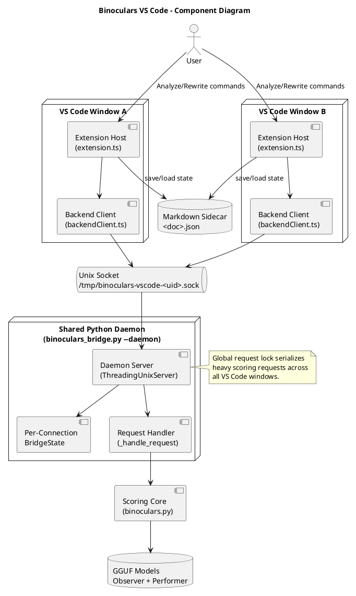
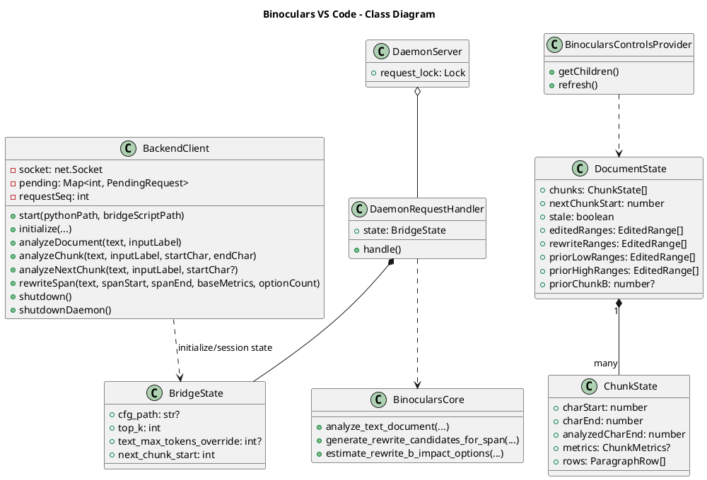
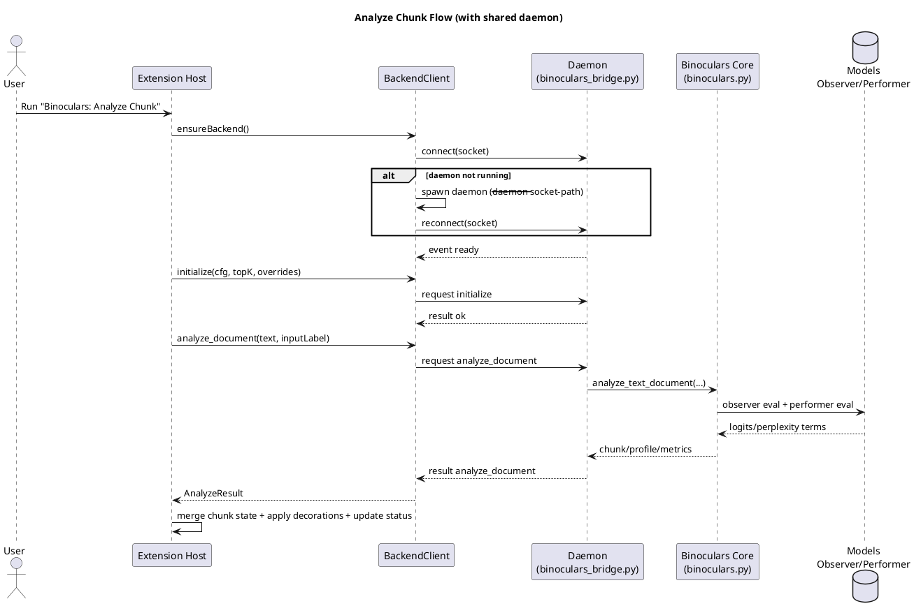
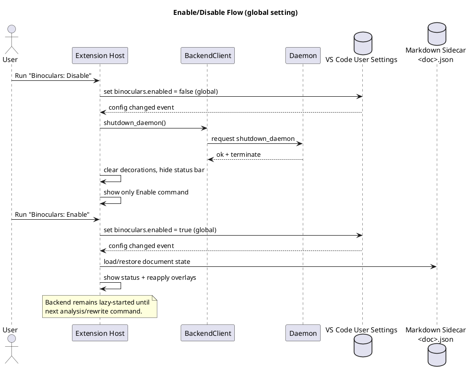

# Binoculars VS Code UML (PlantUML)

This file provides architecture diagrams for the VS Code extension and shared daemon backend.

## Component Diagram

## Class Diagram

## Sequence Diagram: Analyze Chunk

## Sequence Diagram: Disable / Re-enable

